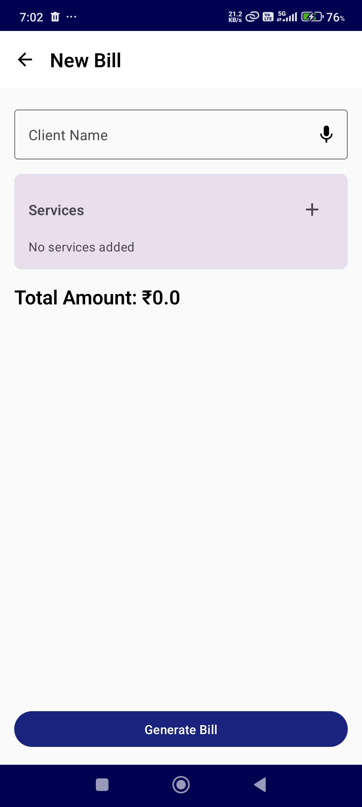
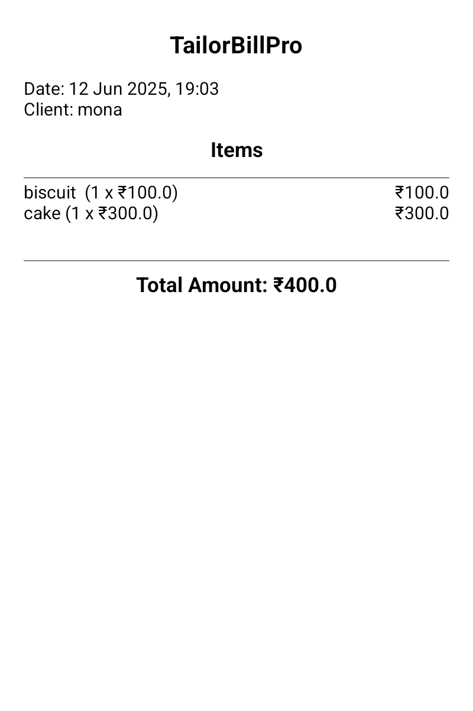
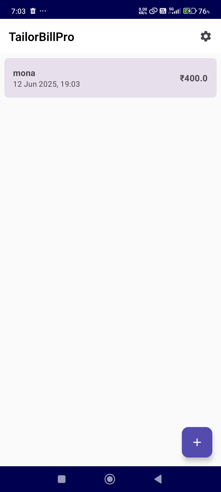

# TailorBillPro 📱

<div align="center">
  
  
  
  
</div>

<br>

A simple and efficient billing application designed for tailors and small businesses to generate professional bills and manage client transactions.

## ✨ Features

- 👤 **Client Management**: Add and manage client information
- 🛍️ **Service/Item Billing**: Add multiple services or items with individual pricing
- 📄 **Bill Generation**: Generate professional bills with itemized details
- 📋 **Bill History**: View and manage previously generated bills
- 🧮 **Real-time Calculations**: Automatic total amount calculation
- 🎨 **Clean UI**: Simple and intuitive user interface

## 📸 Screenshots

<div align="center">
  <table>
    <tr>
      <td align="center">
        <h3>New Bill Screen</h3>
        
        <br>
        <em>Create bills with client details</em>
      </td>
      <td align="center">
        <h3>Bill Details</h3>
        
        <br>
        <em>View itemized bill breakdown</em>
      </td>
      <td align="center">
        <h3>Bill History</h3>
        
        <br>
        <em>Manage all generated bills</em>
      </td>
    </tr>
  </table>
</div>

### 🔧 App Functionality
- ✅ Create new bills with client details
- ✅ Add multiple items/services with quantities and prices
- ✅ Automatic total calculation
- ✅ View all generated bills in an organized list
- ✅ Quick access to bill details and amounts
- ✅ Date and time stamps for each transaction

## 🏗️ App Architecture

The app consists of three main screens:

| Screen | Description |
|:---:|:---|
| 🏠 **Home Screen** | Display list of all generated bills with client names and amounts |
| ➕ **New Bill Screen** | Create new bills by adding client name and services |
| 📄 **Bill Details Screen** | View itemized bill with client info, items, and total amount |

## 🛠️ Technical Details

| Feature | Details |
|:---|:---|
| **Platform** | Android |
| **UI Framework** | Native Android with Material Design components |
| **Currency** | Indian Rupees (₹) |
| **Date Format** | DD MMM YYYY, HH:MM |

## 📥 Installation

### Option 1: Download APK
```bash
1. Download the APK file from the releases section
2. Enable "Install from Unknown Sources" in your Android settings
3. Install the APK file
4. Launch TailorBillPro
```

### Option 2: Build from Source
```bash
git clone https://github.com/Rohith-DR/TailorBillPro.git
cd TailorBillPro
./gradlew assembleDebug
```

## 📖 Usage

### Creating a New Bill

```
1️⃣ Tap the "+" button on the home screen
2️⃣ Enter the client name
3️⃣ Add services/items by tapping the "+" button in the Services section
4️⃣ Enter item name, quantity, and price for each service
5️⃣ Review the automatically calculated total
6️⃣ Tap "Generate Bill" to save
```

### Viewing Bills
- 📋 All generated bills appear on the home screen
- 👁️ Each bill shows client name, date/time, and total amount
- 👆 Tap on any bill to view detailed breakdown

## 📄 Sample Bill Format

```
┌─────────────────────────────────┐
│           TailorBillPro         │
├─────────────────────────────────┤
│ Date: 12 Jun 2025, 19:03       │
│ Client: mona                    │
│                                 │
│ Items                           │
│ ─────────────────────────────── │
│ biscuit (1 x ₹100.0)     ₹100.0│
│ cake (1 x ₹300.0)        ₹300.0│
│                                 │
│ ─────────────────────────────── │
│ Total Amount: ₹400.0            │
└─────────────────────────────────┘
```

## 📋 Requirements

- 📱 Android 5.0 (API level 21) or higher
- 💾 10 MB available storage space
- 🔢 Support for numeric input

## 📝 Version History

| Version | Date | Changes |
|:---:|:---:|:---|
| **v1.0.0** | 2025-06-12 | • Initial release<br>• Basic billing functionality<br>• Client management<br>• Bill history |

## 🤝 Contributing

We welcome contributions! Here's how you can help:

### 🚀 Getting Started
```bash
# Fork the repository
git clone https://github.com/Rohith-DR/TailorBillPro.git

# Create a feature branch
git checkout -b feature/AmazingFeature

# Make your changes and commit
git commit -m 'Add some AmazingFeature'

# Push to the branch
git push origin feature/AmazingFeature

# Open a Pull Request
```

### 📝 Contribution Guidelines
- 🐛 **Bug Reports**: Use the issue template
- ✨ **Feature Requests**: Describe the feature and its benefits
- 💻 **Code Style**: Follow Android development best practices
- 🧪 **Testing**: Include tests for new features

## 📄 License

```
MIT License

Copyright (c) 2025 TailorBillPro

Permission is hereby granted, free of charge, to any person obtaining a copy
of this software and associated documentation files (the "Software"), to deal
in the Software without restriction, including without limitation the rights
to use, copy, modify, merge, publish, distribute, sublicense, and/or sell
copies of the Software, and to permit persons to whom the Software is
furnished to do so, subject to the following conditions:

The above copyright notice and this permission notice shall be included in all
copies or substantial portions of the Software.
```

## 🆘 Support

| Type | Link |
|:---:|:---|
| 🐛 **Bug Reports** | [Create Issue](https://github.com/Rohith-DR/TailorBillPro/issues) |
| 💡 **Feature Requests** | [Create Issue](https://github.com/Rohith-DR/TailorBillPro/issues) |
| 📖 **Documentation** | [Wiki](https://github.com/Rohith-DR/TailorBillPro/wiki) |
| 💬 **Discussions** | [Discussions](https://github.com/Rohith-DR/TailorBillPro/discussions) |

## 👨‍💻 Developer

<div align="center">
  <br>
  <p>Developed with ❤️ for small businesses and tailors to streamline their billing process.</p>
  <br>
  
**⭐ Star this repo if you find it helpful!**
  
  <br>
  
  [](https://github.com/Rohith-DR/TailorBillPro/stargazers)
  [](https://github.com/Rohith-DR/TailorBillPro/network/members)
  [](https://github.com/Rohith-DR/TailorBillPro/watchers)
</div>

---

<div align="center">
  <strong>📱 TailorBillPro - Simplifying Business Billing</strong>
  <br><br>
  <em>Perfect for tailors, small businesses, and service providers who need a simple, offline billing solution.</em>
</div>
